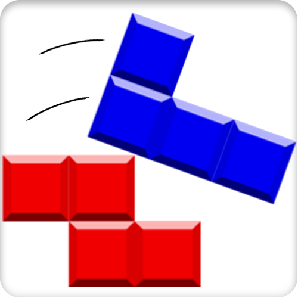

# AWKWARD TOWERS



## Installation

### Setup the back-end

Since the back-end is not setup online, you have to do it yourself:

1. Install mogoose on your machine [here](https://www.mongodb.com/docs/manual/installation/)
2. run those commands:

```
cd api/
npm i
npm start
```

### Run the application

1. Go back to the root `cd ..` if you are on `api/`
2. `npm i`
3. `npm start`

Create an account and enjoy !
